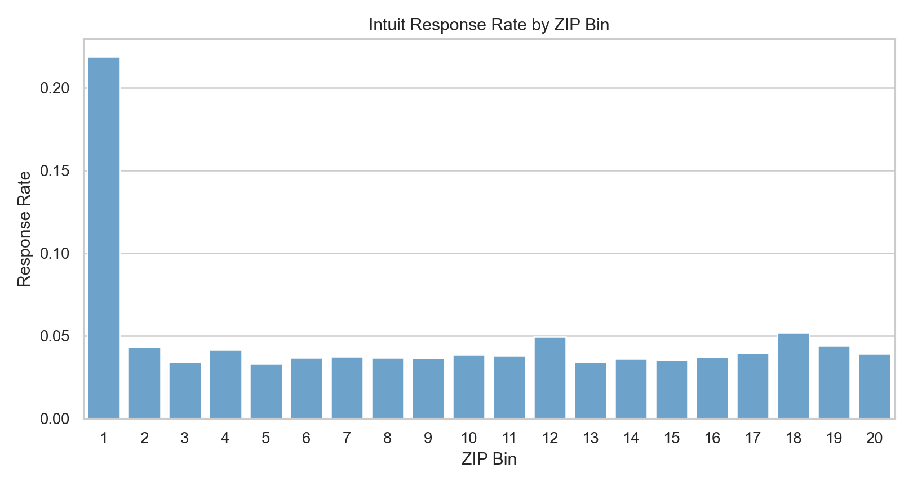
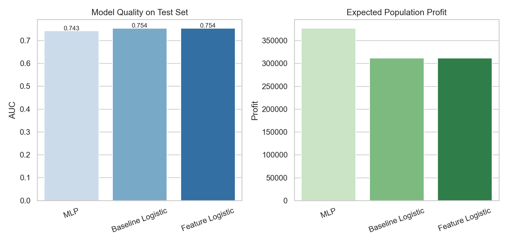
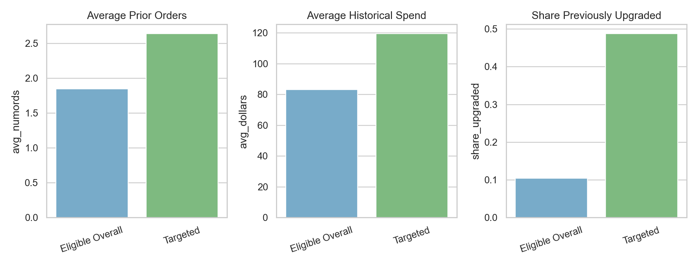

## Business Context

This case focuses on Intuit's effort to promote an upgrade to QuickBooks 3.0. The setting is historically old, but the analytics problem is still highly relevant: after a first mailing campaign, which small-business customers should receive a second mailing?

The objective was not to maximize response rate in the abstract. It was to decide which non-responders from wave 1 were still worth contacting in wave 2 once direct-mail cost and contribution margin were taken into account.

That makes the case a classic example of targeted lifecycle marketing: use customer history to decide where incremental outreach is likely to pay off.

## The Decision Problem

Intuit had already mailed `801,821` businesses in wave 1, and `38,487` of them responded. That left a wave-2 eligible population of `763,334` businesses who had not yet upgraded.

The dataset I worked with was a random sample of `75,000` businesses from the larger campaign universe. The target variable, `res1`, indicated whether a business responded to the first upgrade mailing.

The practical question was:

Which businesses should be selected for wave 2 so that the expected profit from the mailing is maximized?

## Data And Features

The core variables described customer value and purchase history:

- number of prior orders
- total dollars spent
- months since last order
- months since original QuickBooks purchase
- current version ownership
- tax product ownership
- prior upgrade behavior
- ZIP-code buckets
- demographic flags such as `sex` and `bizflag`

I also added several engineered features to make the models more expressive, including:

- `log_dollars`
- `log_numords`
- `avg_order_value`
- recent / stale buyer flags
- a tax-product × prior-upgrade interaction

That feature engineering step helped translate raw customer history into signals that are more useful for marketing response modeling.

One simple exploratory result from the notebook was especially revealing: ZIP-code buckets had highly uneven response behavior. In the sample, the top ZIP bin was a dramatic outlier, which suggests there was real geographic structure in upgrade propensity rather than pure noise.



## Modeling Strategy

I compared three approaches on the test set:

- a baseline logistic regression
- a feature-engineered logistic regression
- a multilayer perceptron (`MLP`)

This comparison mattered because I did not want to assume that the most interpretable model would also be the most profitable. In targeting problems, a model with slightly better ranking quality can generate significantly different campaign economics.

The feature engineering and model fitting stage looked roughly like this:

```python
intuit = intuit.with_columns(
    log_dollars=pl.col("dollars").log1p(),
    log_numords=pl.col("numords").log1p(),
    avg_order_value=(pl.col("dollars") / pl.col("numords").clip(lower_bound=1)),
    recent_buyer=(pl.col("last") <= 12).cast(pl.Int8),
    stale_buyer=(pl.col("last") >= 24).cast(pl.Int8),
)

mlp_model = rsm.model.mlp(
    data={"train": train_df},
    rvar="res1",
    lev="yes",
    evar=model_features,
    hidden_layer_sizes=(16, 8),
)
```

## Key Assumptions

The notebook used the following campaign assumptions:

- mail cost per piece: `1.41`
- margin per responder: `60.0`
- wave-2 response adjustment: `0.50`

Those assumptions allowed me to convert predicted response into expected profit rather than reporting only AUC or classification accuracy.

## Test-Set Comparison

The model comparison showed a useful pattern:

- the two logistic models produced the best AUC values, around `0.754`
- the `MLP` had slightly lower AUC at about `0.743`
- but the `MLP` generated the highest expected test profit

That result is a good reminder that the "best" model depends on the business objective. If the goal had been pure discrimination, I might have preferred the logistic models. But because the campaign decision depends on profit at a chosen targeting depth, the `MLP` became the operational winner.

In the test sample, the best rule was:

- best model: `MLP`
- selected test businesses: `5,643`
- score threshold: about `0.047`
- expected test profit: about `10,578`
- expected test responders: about `309`

| Model | Test AUC | Selected Customers | Expected Population Profit |
|---|---:|---:|---:|
| Baseline Logistic | 0.754 | 6,188 | 312,086 |
| Feature Logistic | 0.754 | 6,212 | 311,855 |
| MLP | 0.743 | 5,643 | 377,367 |



## Scaling To The Full Wave-2 Population

The stronger result came after scaling the selected strategy to the full wave-2 eligible population.

Using the best-performing model, the notebook projected:

- wave-2 eligible population: `763,334`
- expected population responders: about `11,020`
- expected population profit: about `377,367`

This is exactly the kind of number that makes a predictive model decision-relevant. Instead of saying "these customers score highly," I could say "this mailing rule is expected to produce meaningful campaign profit at scale."

## Who Was Most Likely To Upgrade?

The targeted group looked materially different from the broader eligible pool.

Relative to the overall eligible population, targeted businesses had:

- higher predicted upgrade probability
- more prior orders
- higher historical spend
- more recent purchase activity
- a much higher share of prior upgrading behavior

One particularly useful business signal was that customers with stronger purchase history and prior upgrade behavior were much more likely to respond again. That is intuitive, but still valuable: the model quantified that intuition and turned it into a mailing rule.



## My Interpretation

What I find most interesting in this case is the tradeoff between interpretability and deployment performance.

The feature-engineered logistic regression remained attractive because it was easier to explain, and its AUC was marginally better. But for operational targeting, the `MLP` produced the highest expected profit, which made it the better execution model in this specific setting.

If I were presenting this to a CRM or growth team, I would frame the recommendation like this:

- use interpretable logistic models to understand the response drivers
- use the strongest profit-generating model to produce the mailing list
- evaluate campaign strategies by expected profit and mailing depth, not by AUC alone

That separation between "understanding" and "execution" is one of the most useful lessons in the project.

## Why This Belongs In My Portfolio

This case demonstrates several strengths I want my portfolio to show:

- translating campaign data into a targeting decision
- engineering features from customer purchase history
- comparing interpretable and non-linear models
- evaluating models using profit rather than only predictive accuracy

It also fits well with the rest of my work because it extends a theme I care about: using analytics to make customer outreach more selective, more efficient, and more defensible.

## Technical Notes

- Tools: `Python`, `Polars`, `pyrsm`
- Methods: logistic regression, feature engineering, neural networks, threshold-based targeting, profit scaling
