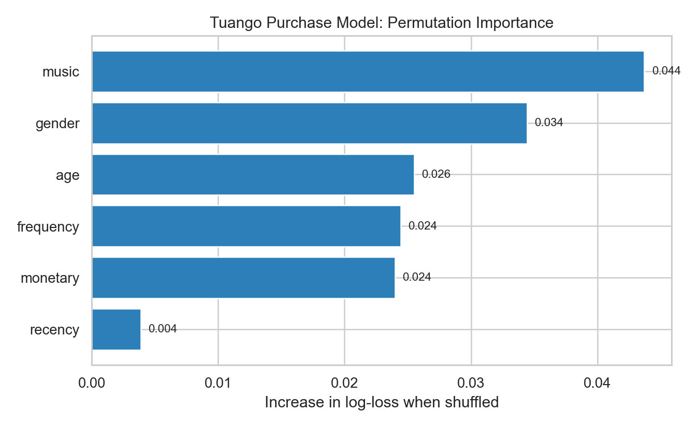
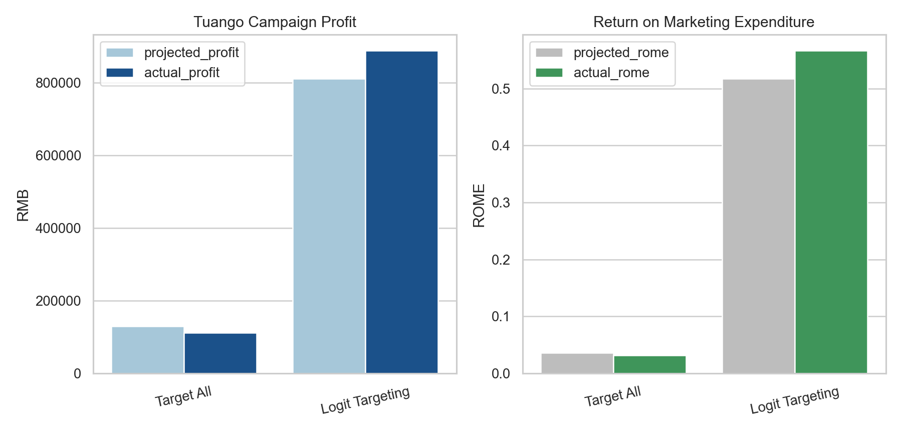

## Business Context

Tuango is a Chinese deal-of-the-day platform whose model resembles Groupon: it promotes discounted offers from local and national merchants and distributes those offers to customers through mobile apps. In the Tuango case, the company wanted to promote a karaoke deal to mobile users in Hangzhou who had shown interest in the category.

What makes the case more interesting than a standard response model is that the message itself is not free. Susan Liu, the newly appointed Chief Data Scientist for Tuango's mobile marketing group, challenged an internal assumption that pushing offers through the app had essentially zero marginal cost. Her concern was behavioral rather than technical: if customers received too many irrelevant messages, they might block future deal notifications altogether and permanently weaken an important marketing channel.

That detail changes the problem from "who is likely to buy?" to a more useful business question:

Which customers should receive a message once the true cost of messaging is taken seriously?

## The Decision Problem

The campaign followed a structured rollout design:

1. Start with all mobile customers in Hangzhou who had shown interest in karaoke: `418,160` customers.
2. Randomly sample `5%` of them, or `20,908` customers, and send the deal to all of them.
3. Use the resulting response data to model purchase probability and order size.
4. Apply the model to the remaining `397,252` rollout customers.
5. Decide whether targeting improves profitability relative to messaging everyone.

That setup is appealing from an analytics perspective because it creates a clear bridge from experimentation to deployment. Rather than fitting a model in the abstract, I could evaluate whether a targeting rule would actually improve profit in the rollout population.

## My Framing

I approached the case as a two-step targeting problem:

1. Estimate the probability that a customer buys the karaoke deal.
2. Compare that probability against a breakeven response threshold implied by campaign economics.

This framing matters because a prediction is only useful when it changes a decision. If messaging costs were truly zero, it might make sense to contact everyone. But once the app-channel cost is acknowledged, the model needs to support a selective rollout policy.

## Data And Features

I used `Polars` and `pyrsm` to build the workflow and work with the case data efficiently.

The customer history variables included:

- `recency`
- `frequency`
- `monetary`
- `age`
- `gender`
- `music`

I first converted purchase response into a binary modeling target:

```python
tuango = tuango.with_columns(
    pl.when(pl.col("buyer") == "yes").then(1)
      .when(pl.col("buyer") == "no").then(0)
      .otherwise(None)
      .alias("buyer_yes")
)
```

In the modeling sample, the average purchase rate was about `9.66%`, and among buyers the average order size was about `3.94` karaoke sessions.

## Modeling Response

I used logistic regression to estimate purchase propensity for the offer:

```python
clf = rsm.model.logistic(
    {"tuango": df_model},
    rvar="buyer",
    lev="yes",
    evar=["recency", "frequency", "monetary", "age", "gender", "music"],
)
```

One useful outcome from the model interpretation stage was that `monetary` and `music` emerged as the most important predictors of purchase behavior. That finding is intuitive: customers with stronger historical spend and clear category affinity were more likely to respond to the karaoke promotion. By contrast, `recency` added relatively little once the richer customer history variables were already in the model.

I also estimated a linear regression for order size among buyers, but that second model turned out to be much weaker. In practical terms, I found that predicting *whether* someone would buy was far easier than predicting *how much* they would buy conditional on response. That asymmetry shaped my interpretation of the case: purchase incidence was where the strongest business signal lived.



## Why The 9 RMB Cost Matters

The case background explains why Tuango treated `9 RMB` as the marginal cost of sending one additional message. That figure was not just an operational messaging fee. It reflected the expected long-run cost of customer fatigue and opt-out behavior in the mobile channel.

This is the most important strategic insight in the case. Once messaging has a real economic cost, the correct decision rule is not "contact everyone with nonzero probability." Instead, the campaign should contact only customers whose expected profit exceeds that marginal cost.

Using the observed mean order size and Tuango's fee structure, I calculated a breakeven response rate of about `9.32%`.

```python
cost = MESSAGE_COST
avg_ordersize_yes = q2.filter(pl.col("buyer") == "yes").select("mean_ordersize").item()
margin = TUANGO_FEE * PRICE_PER_SESSION * avg_ordersize_yes

breakeven = cost / margin
```

That threshold became the operational cutoff for the rollout.

The table below is the key decision summary I would show to a marketing manager before launch:

| Strategy | Customers Messaged | Expected Response Rate | Expected Profit (RMB) | ROME |
|---|---:|---:|---:|---:|
| Message Everyone | 397,252 | 9.66% | 130,019 | 3.6% |
| Logistic Targeting | 174,126 | 14.04% | 810,139 | 51.7% |

## What Happens If Tuango Targets Everyone?

The baseline policy is simple: send the karaoke offer to all `397,252` remaining rollout customers.

Under that strategy, the projected economics were:

- messages sent: `397,252`
- projected profit: about `130,019 RMB`
- projected return on marketing expenditure: about `3.6%`

That is profitable, but only marginally so. A strategy like this risks overspending on many low-value customers whose response probability is barely above zero.

## What Happens Under Model-Based Targeting?

I then used the logistic model to target only customers whose predicted response probability exceeded the breakeven threshold. That reduced the outreach list to `174,126` customers.

The targeting step itself was straightforward: score the rollout audience, compare each score with the breakeven rate, and keep only the customers whose expected response exceeded the economic hurdle.

```python
rollout_scored = clf.predict(data={"rollout": tuango_rollout})["rollout"]

targeted_rollout = (
    rollout_scored
    .with_columns((pl.col("pred_yes") >= breakeven).alias("target"))
    .filter(pl.col("target"))
)
```

The model-based targeting policy produced much stronger projected economics:

- messages sent: `174,126`
- projected response rate: about `14.04%`
- projected profit: about `810,139 RMB`
- projected return on marketing expenditure: about `51.7%`

The business logic is straightforward: send fewer messages, but send them to people who are much more likely to respond profitably.

## Rollout Evaluation On Post Data

A strong portfolio case should go beyond projected model performance, so I also paid close attention to the post-rollout evaluation. In the notebook, I re-created the targeting logic on `tuango_post.parquet` and compared "target all" with logit-based targeting using actual outcomes.

That comparison is the most convincing result in the project:

```text
Target All      profit ≈ 111,712.5 RMB   rome ≈ 0.031
Logit Targeting profit ≈ 887,423.0 RMB   rome ≈ 0.566
```

So even after moving from the planning stage to realized rollout results, the selective targeting policy dramatically outperformed the naive strategy of contacting everyone.

Two numbers summarize the difference:

- profit rose from roughly `112k RMB` to `887k RMB`
- marketing return increased from about `3.1%` to `56.6%`

That is the kind of lift that makes a targeting model operationally worthwhile.



## My Interpretation

What I like most about this case is that the final answer is not really "logistic regression works." The more important conclusion is that **a campaign model should be evaluated against decision economics, not only against statistical fit**.

In this case, three ideas mattered:

- customer targeting should reflect channel cost, not just response likelihood
- purchase probability was much more predictable than order size
- model deployment should be judged on realized profit, not only in-sample calibration

If I were communicating this to a growth or CRM team, my recommendation would be clear: keep the mobile channel selective, use the model to filter the audience, and treat irrelevant messaging as a real cost because it degrades long-term customer contactability.

## Why This Belongs In My Portfolio

This project reflects the kind of analytics work I enjoy most: turning a real business constraint into a decision rule that improves profit. It sits at the intersection of marketing analytics, experimentation, customer targeting, and model interpretation.

It also reflects an approach I want my portfolio to show consistently: not just building a model, but asking whether the model changes what the business should do.

## Technical Notes

- Tools: `Python`, `Polars`, `pyrsm`, `plotnine`
- Methods: logistic regression, permutation importance, threshold optimization, rollout evaluation
