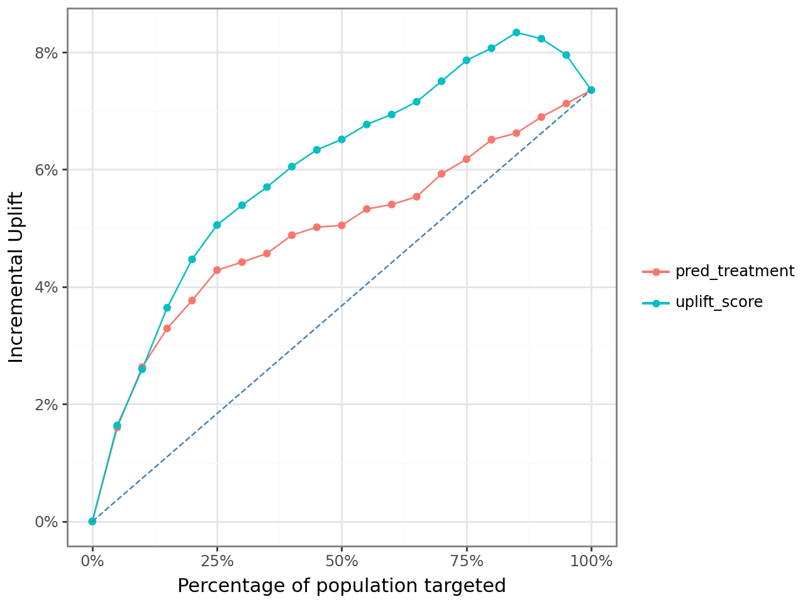
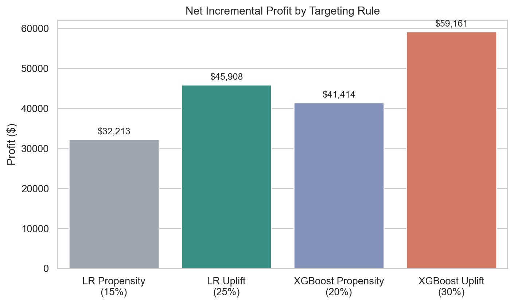
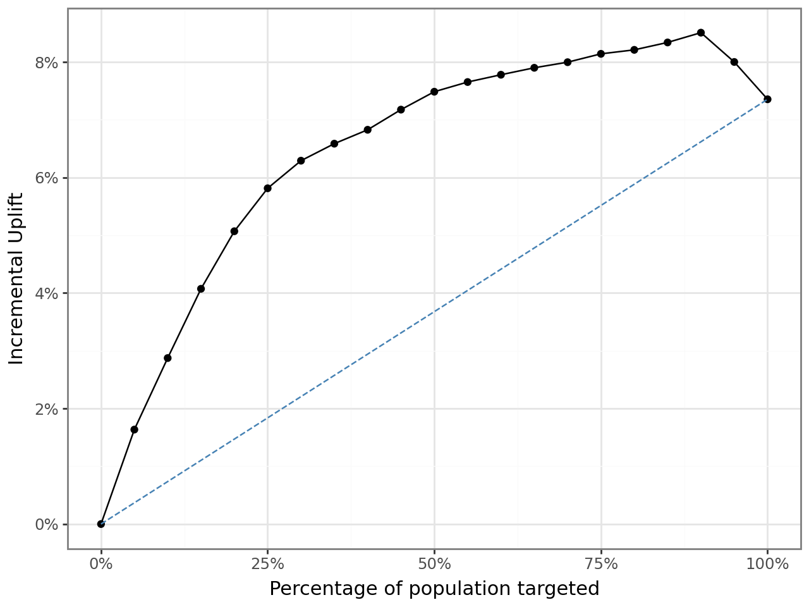
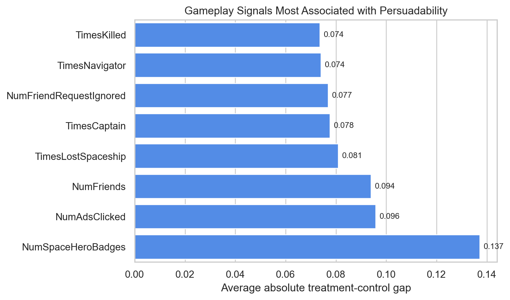

Creative Gaming was one of the most useful cases in my MSBA coursework because it forced me to answer a better question than the usual "who is likely to buy?" In this campaign, the real goal was to figure out **who is likely to buy because of the ad**.

That difference sounds subtle, but it changes the entire modeling strategy. A standard response model can easily overvalue users who were already going to convert on their own. An uplift model tries to isolate the incremental effect of outreach and spend money only where the ad actually moves behavior.

## Why This Case Was Different

The business setup was centered on a campaign for **Zalon**, a paid in-game offer. Haruki, the decision-maker in the case, wanted to choose whom to target using experimental evidence rather than intuition.

The assignment provided a rare and valuable structure:

- a `30,000`-user organic control group that did **not** receive an ad
- a `30,000`-user randomized ad group that **did** receive an ad
- a broader `150,000`-user treatment file, from which `120,000` users remained as the deployable audience after holding out a random `30,000`

That design made causal targeting possible. Instead of guessing treatment effect from observational data, I could compare outcomes across treated and untreated users and learn which player profiles were genuinely persuadable.

## What I Wanted The Model To Do

I framed the project around a ranking problem:

1. Predict the probability of conversion under treatment.
2. Predict the probability of conversion under no treatment.
3. Take the difference between those two predictions.
4. Rank users by that incremental gap rather than by raw purchase propensity.

In code, the core scoring rule was simple:

```python
test_pd["uplift_score"] = (
    test_pd["pred_treatment"] - test_pd["pred_control"]
)
```

That one subtraction is the heart of the case. It turns a standard response model into a decision tool for ad allocation.

To estimate those two counterfactual probabilities, I trained separate response models on treated and untreated users and scored the holdout sample with both:

```python
clf_treatment = rsm.model.logistic(
    data={"treat": train_df.filter(pl.col("ad") == 1)},
    rvar="converted",
    lev="yes",
    evar=evar,
)

clf_control = rsm.model.logistic(
    data={"control": train_df.filter(pl.col("ad") == 0)},
    rvar="converted",
    lev="yes",
    evar=evar,
)
```

## The Experiment Inside The Data

To create an RCT-style modeling sample, I stacked the organic control users and randomized ad users into one dataset and carried a binary `ad` flag through the workflow.

```python
cg_ad_random = cg_ad_random.with_columns(pl.lit(1).alias("ad"))
cg_organic_control = cg_organic_control.with_columns(pl.lit(0).alias("ad"))
cg_rct_stacked = pl.concat([cg_organic_control, cg_ad_random], how="vertical")
```

I then created a stratified train/test split so that treatment status and conversion rates stayed balanced across the modeling pipeline. That step matters more than it looks. If the split distorts treatment/control balance, uplift estimates become noisy very quickly.

## Where Uplift Beat Propensity

The most convincing first result came from comparing **logistic uplift targeting** with **logistic propensity targeting** across the ranked list of users.

The red line below is the naive alternative: rank users by the predicted probability of purchase *given* an ad.  
The teal line is the better causal alternative: rank users by the difference between predicted purchase probability *with* an ad and predicted purchase probability *without* an ad.



What I like about this chart is that it shows the business mistake very clearly. The propensity model still finds responsive users, but the uplift model does a better job concentrating truly persuadable users near the top of the list. That is exactly where paid acquisition and CRM teams make money.

At a fixed rollout depth of `25%` of the `120,000`-user deployment population, the notebook estimated:

| Model family | Ranking rule | Targeted share | Customers targeted | Net incremental profit |
|---|---|---:|---:|---:|
| Logistic Regression | Propensity | 25% | 30,000 | $19,266 |
| Logistic Regression | Uplift | 25% | 30,000 | $22,727 |

So even before tuning the optimal cutoff, uplift modeling generated about **$3,461** more incremental profit than the comparable propensity rule.

## The More Important Question Was "How Deep Should We Go?"

The notebook became much more interesting once I stopped treating targeting depth as fixed.

Instead of assuming we should always target 25% of users, I calculated cumulative profit as:

$$
\text{Incremental profit} =
\text{incremental responses} \times \text{revenue per purchase}
- \text{customers targeted} \times \text{cost per ad}
$$

Using the campaign assumptions from the case:

- revenue per purchase: `$14.99`
- cost per ad: `$1.50`

I searched for the targeting depth that maximized cumulative incremental profit.

This is where the uplift framing became much more valuable. The best rollout rule did **not** target the same share of customers as the best propensity rule.



The optimal rules from the notebook were:

| Strategy | Best targeting depth | Net incremental profit |
|---|---:|---:|
| Logistic Propensity | 15% | $32,213 |
| Logistic Uplift | 25% | $45,908 |
| XGBoost Propensity | 20% | $41,414 |
| XGBoost Uplift | 30% | $59,161 |

That table is the real punchline of the case. The uplift model did not just reorder the same audience a little better. It changed the recommended budget allocation and the optimal size of the campaign.

## What The Tree Model Added

I also reviewed non-linear models in the notebook, especially XGBoost. The XGBoost uplift curve was stronger than the logistic version and stayed elevated longer before tapering off.

For the tree-based version, the core idea stayed the same even though the model class changed: estimate treatment and control response separately, then rank players by the gap.

```python
tab_uplift_xgb = rsm.model.uplift_tab(
    test_df_xgb,
    "converted",
    "yes",
    "uplift_score_xgb",
    "ad",
    1,
    qnt=20,
)
```



This mattered operationally. Under the logistic uplift model, the best audience size was `25%`. Under XGBoost uplift, the best audience size moved to `30%`, and the projected profit improved further.

That is a good example of when I would use interpretable models for diagnosis but still be willing to deploy a more flexible ranking model if the profit evidence is compelling.

## What A Persuadable Player Looked Like

One of the useful side analyses in the notebook scanned gameplay variables by average treatment-control gap. The strongest signals were not generic demographics. They were indicators of in-game engagement and social play.



The most revealing features were:

- `NumSpaceHeroBadges`
- `NumAdsClicked`
- `NumFriends`
- `TimesLostSpaceship`
- `TimesCaptain`

That pattern tells a compelling product story. The users most likely to be influenced by an ad were not necessarily the users with the highest raw purchase probability. They were users with evidence of engagement, exploration, and responsiveness inside the game environment.

To me, that is a much stronger business insight than simply saying "high scorers buy more." It suggests that ad effectiveness depended on where the player was in the gameplay loop and how socially embedded they already were.

## What I Would Tell A Growth Team

If I were presenting this case to a marketing or growth lead, my recommendation would be:

- do not rank users only by conversion propensity
- treat incremental lift as the primary targeting signal
- tune the audience size jointly with the model, because the best cutoff is part of the strategy
- use the uplift model to find persuadable users and avoid spending on sure-things or lost-causes

That recommendation is what makes this project portfolio-worthy for me. It moves beyond model fitting and into resource allocation.

## Why I Kept This In My Portfolio

This case shows several things I want employers to see:

- I can work from randomized treatment-control data rather than only observational data
- I understand the difference between prediction and causation in targeting problems
- I can connect model outputs to rollout depth, cost assumptions, and profit
- I can turn a classroom notebook into a business-facing recommendation

It is one of the clearest examples in my coursework of using analytics to answer not just "who will respond?" but "where does the ad create value?"

## Technical Footnote

- Tools: `Python`, `Polars`, `pyrsm`, `plotnine`, `scikit-learn`
- Methods: uplift modeling, treatment/control scoring, cumulative profit optimization, model comparison
